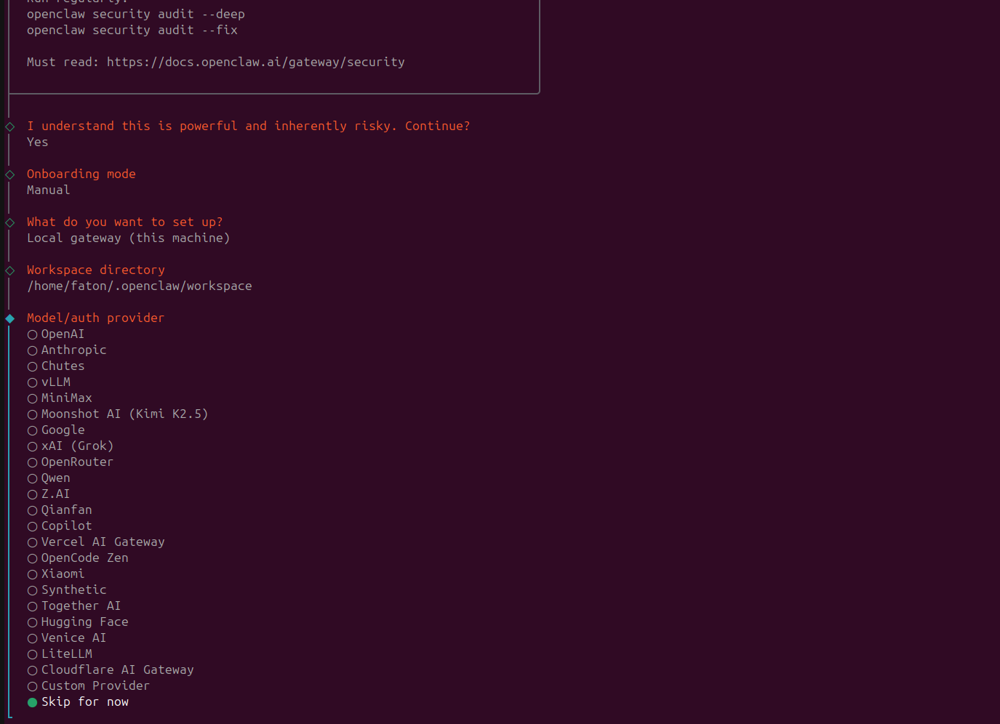
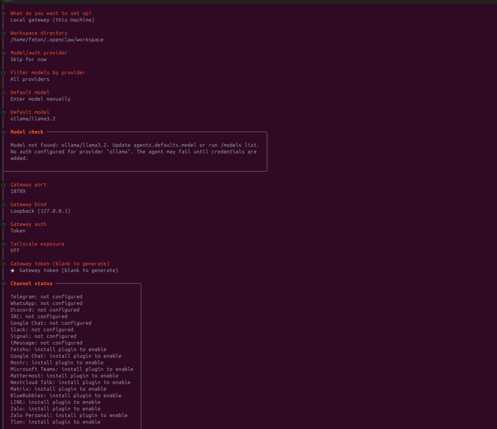
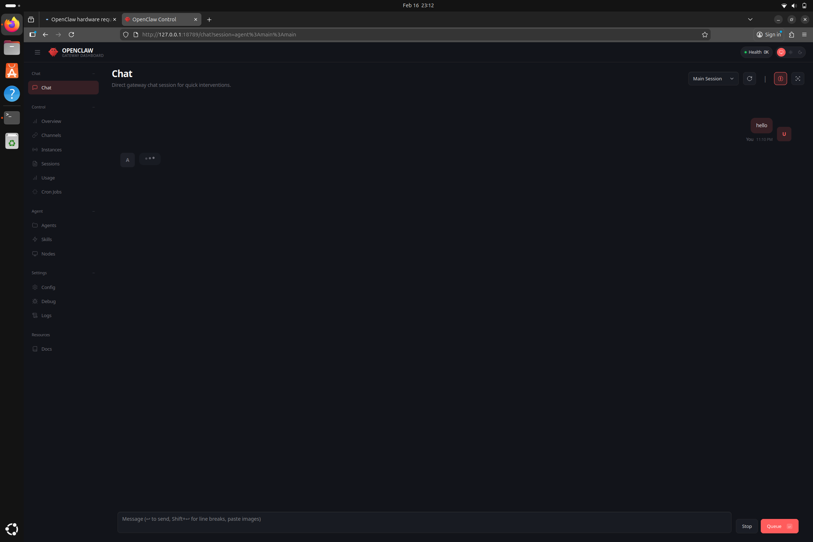
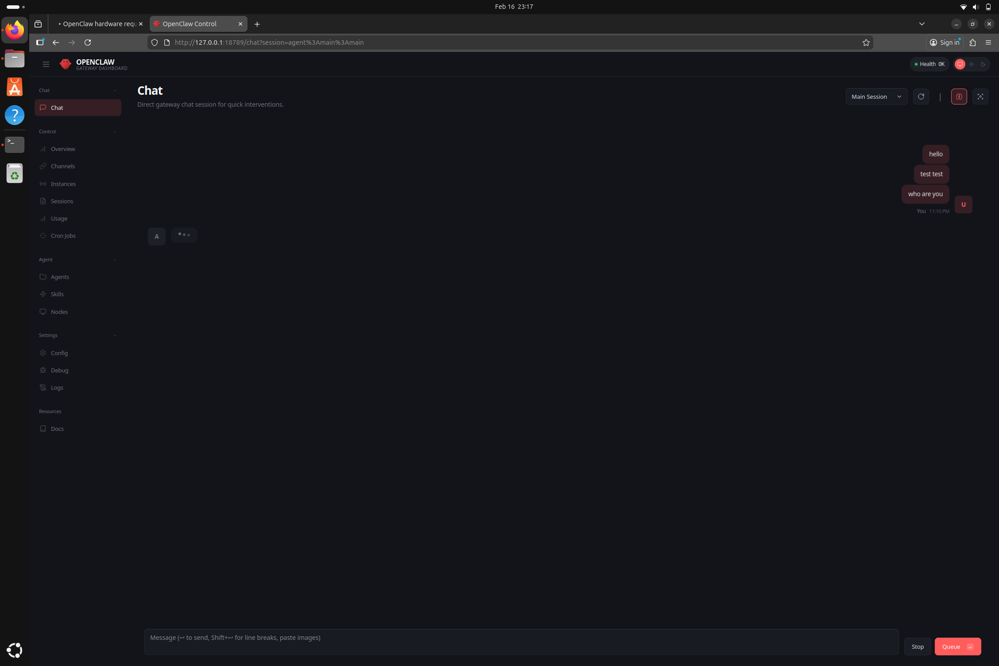
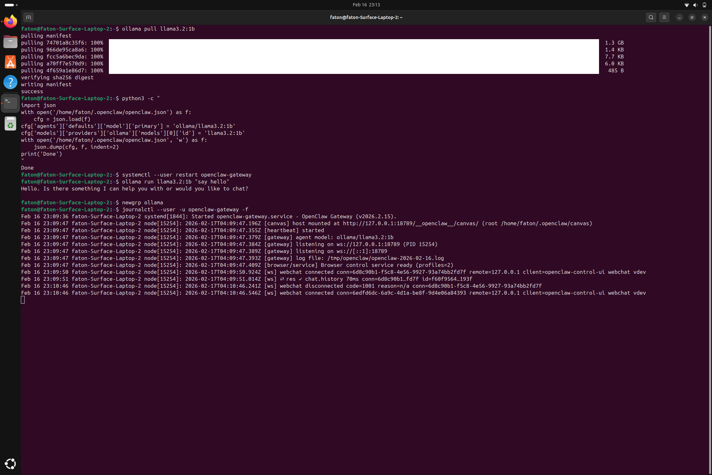
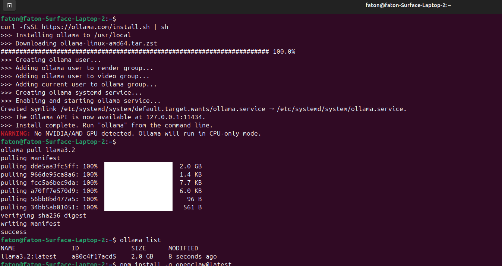
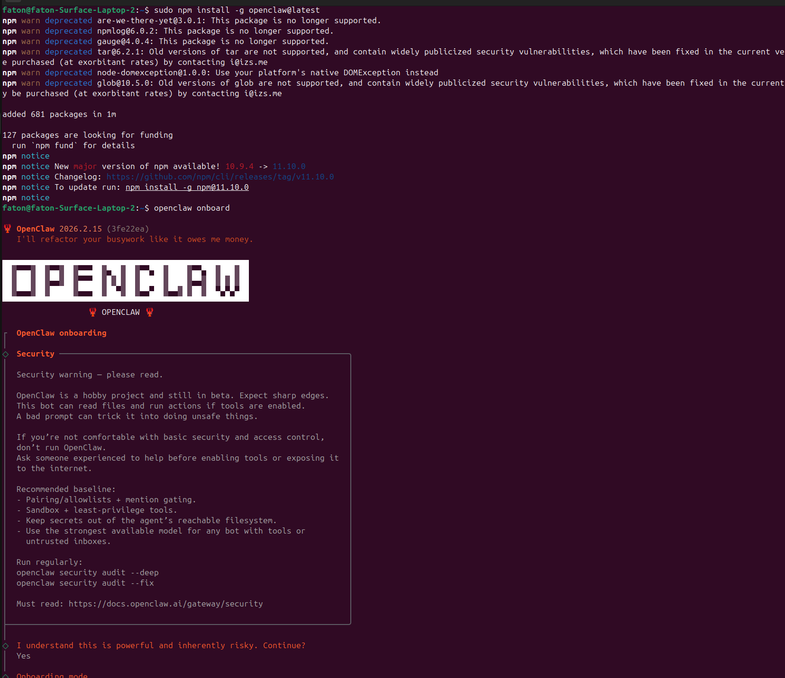
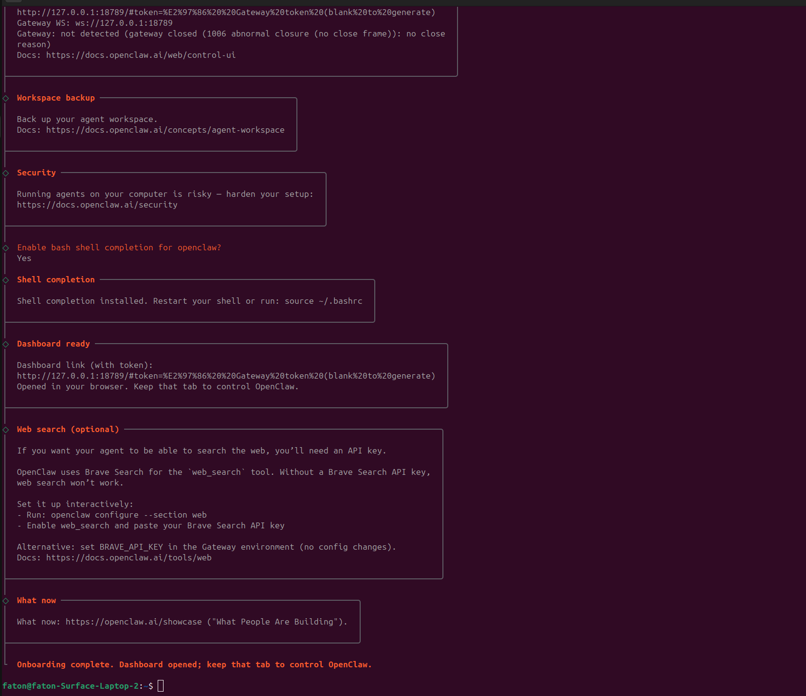

# Bug Report: Ollama Local Model Never Returns a Response in Chat

**OpenClaw Version:** 2026.2.15 (3fe22ea)  
**Date:** 2026-02-16  
**Platform:** Ubuntu 24, Intel i5-8250U, CPU-only (no GPU)

---

## Summary

When configuring OpenClaw to use a local Ollama model, the chat interface shows the agent as "thinking" (spinning dots) indefinitely and **never returns a response**. Ollama works correctly when tested directly via CLI. The issue persists across both `llama3.2:latest` (3B) and `llama3.2:1b` models.

---

## Environment

| Component | Details |
|-----------|---------|
| OpenClaw | 2026.2.15 (3fe22ea) |
| OS | Ubuntu 24.04 (Surface Laptop 2, migrated from Windows) |
| CPU | Intel Core i5-8250U @ 1.60GHz (4 cores) |
| RAM | 7.7GB total, ~5.6GB free |
| GPU | None — CPU-only mode |
| Node.js | v22.12.0 |
| Ollama | Latest (reinstalled) |
| Models tested | llama3.2:latest (3B, 2.0GB), llama3.2:1b (1.3GB) |

---

## Bug 1: Ollama Missing from Onboarding Provider List

During `openclaw onboard`, Ollama does not appear in the **Model/Auth Provider** list. The list includes OpenAI, Anthropic, Google, and many others — but no Ollama or local model option.

**Screenshot:** `02-onboarding-no-ollama-provider.png`



The user is forced to either **Skip for now** or use **Enter model manually** as a workaround.

---

## Bug 2: "Unknown model: ollama/llama3.2" Error After Manual Entry

After manually entering `ollama/llama3.2`, the onboarding wizard itself warns:

```
Model not found: ollama/llama3.2. Update agents.defaults.model or run /models list.
No auth configured for provider "ollama". The agent may fail until credentials are added.
```

**Screenshot:** `04-manual-model-entry-warning.png`



After completing onboarding, the gateway logs confirm the failure:

```
[diagnostic] lane task error: lane=main error="Error: Unknown model: ollama/llama3.2"
[diagnostic] lane task error: lane=session:agent:main:main error="Error: Unknown model: ollama/llama3.2"
Embedded agent failed before reply: Unknown model: ollama/llama3.2
```

---

## Bug 3: `baseURL` Is Not a Valid Config Key

Attempting to configure Ollama by adding `baseURL` to `agents.defaults.models.ollama/llama3.2` in `openclaw.json` causes the gateway to crash:

```
agents.defaults.models.ollama/llama3.2: Unrecognized key: "baseURL"
Config invalid
Run: openclaw doctor --fix
```

The documented approach of setting `baseURL` in the model config does not work.

---

## Bug 4: Chat Never Responds Even After Workaround Config

After applying the `models.providers.ollama` workaround config with `openai-responses` API:

```json
"models": {
  "mode": "merge",
  "providers": {
    "ollama": {
      "baseUrl": "http://127.0.0.1:11434/v1",
      "apiKey": "ollama",
      "api": "openai-responses",
      "models": [{
        "id": "llama3.2",
        "name": "Llama 3.2",
        "reasoning": false,
        "input": ["text"],
        "cost": { "input": 0, "output": 0, "cacheRead": 0, "cacheWrite": 0 },
        "contextWindow": 32000,
        "maxTokens": 4096
      }]
    }
  }
}
```

The gateway starts cleanly and logs confirm `agent model: ollama/llama3.2`, but **chat messages are never answered**.

**Screenshot:** `06-chat-no-response.png` — First attempt, agent stuck on `...`



**Screenshot:** `08-chat-still-no-response.png` — After switching to llama3.2:1b, still no response



---

## Proof That Ollama Works Independently

Ollama responds correctly when tested directly from the terminal:

```bash
$ ollama run llama3.2:1b "say hello"
Hello. Is there something I can help you with or would you like to chat?
```

**Screenshot:** `07-ollama-1b-pulled-gateway-logs.png`



This confirms the issue is in **OpenClaw's communication with Ollama**, not in Ollama itself.

---

## Steps to Reproduce

1. Install Ollama: `curl -fsSL https://ollama.com/install.sh | sh`
2. Pull model: `ollama pull llama3.2`
3. Install OpenClaw: `sudo npm install -g openclaw@latest`
4. Run `openclaw onboard` → Ollama is absent from provider list
5. Choose **Skip for now** for Model/Auth provider
6. Manually enter `ollama/llama3.2` as default model
7. Complete onboarding, start gateway service
8. Open dashboard at `http://127.0.0.1:18789`
9. Send any message in chat
10. **Agent thinks forever, no response**

---

## Installation Screenshots (For Reference)

**Screenshot:** `01-ollama-install-and-pull.png` — Ollama installed and model pulled successfully



**Screenshot:** `03-openclaw-install-and-onboard.png` — OpenClaw installed and onboarding started



**Screenshot:** `05-onboarding-complete.png` — Onboarding completed successfully



---

## Expected Behavior

- Ollama should appear as a provider option during `openclaw onboard`
- After configuration, chat should return a response from the local model
- CPU-only mode should be supported for users without a GPU

## Actual Behavior

- Ollama is missing from the onboarding provider list
- Manual config results in "Unknown model" errors
- Even after workaround config, chat never responds
- No error appears in logs when a message is sent — it just silently times out

---

## Additional Notes

- `OLLAMA_BASE_URL=http://localhost:11434` was set as environment variable — no effect
- `OLLAMA_API_KEY=ollama` was also set — no effect
- Ollama service is running as a system service (`/etc/systemd/system/ollama.service`)
- OpenClaw gateway runs as a user systemd service
- The issue reproduces with both `llama3.2:latest` (3B) and `llama3.2:1b`
